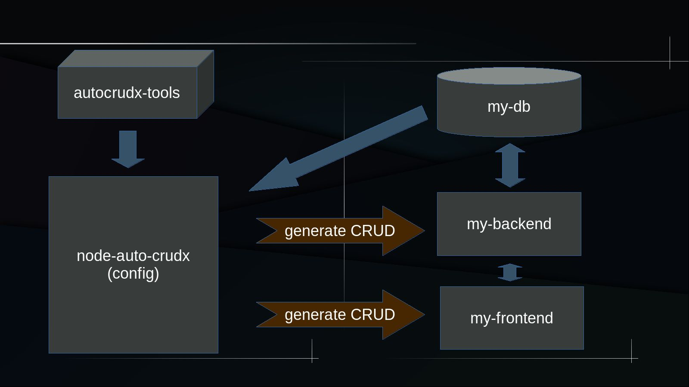

# Comenzar

:::warning Advertencia
Este proyecto de código abierto está creado bajo la visión de un Producto Mínimo Viable.

[Eres bienvenido si deseas contribuir de alguna manera](./contribution.html).
:::

## ¿ Qué es un CRUD ?

En informática, [CRUD](https://en.wikipedia.org/wiki/Create,_read,_update_and_delete) es el acrónimo de _"Crear"_, _"Leer"_, _"Actualizar"_ y _"Borrar"_, (del original en inglés, _Create, Read, Update and Delete_), que se usa para referirse a las funciones básicas en bases de datos o la capa de persistencia en un software.

:::info Ejemplos

Los siguientes ejemplos de **CRUDs** son creados a travéz del programa ***Auto-CRUDx***, que está desarrollada en [Node](https://nodejs.org/). Pero su **_stack_**, tanto del _backend_ como del _frontend_, es generado para [Laravel](https://laravel.com/) y [Vue](https://vuejs.org/) respectivamente.
:::

## 1° CRUD Básico (ejemplo)

El siguiente video muestra ejemplos de CRUDs para tablas simples que generalmente se usan para llenar listas desplegable como elementos `select` de HTML.

<video controls>
  <source src="./assets/get-start-1.mp4">
</video>

## 2° CRUD Intermedio (ejemplo)

Los CRUDs intermedios son aquellos un poco más elaborados, los cuales generalmente tratan sobre un formulario que contiene varios campos de distintos tipos. Como el que muestra el siguiente video.

<video controls>
  <source src="./assets/get-start-2.mp4">
</video>

## 3° CRUD Avanzado (ejemplo)

Los CRUDs avanzados son los más complejos, porque generalmente están constituidos por múltiples formularios. Específicamente, un formulario para una tabla maestra y **_N_** formularios para **_N_** tablas detalles. Como el que muestra el siguiente video.

<video controls>
  <source src="./assets/get-start-3.mp4">
</video>

:::tip Información
El código generado de ejemplos anteriores se basa en una arquitectura muy particular. Es recomendable que use su propio criterio cuando cree el suyo. Usted puede consultar el código generado, tanto del [Backend](https://github.com/CaribesTIC/laravuel-api/tree/main/Modules/Meeting) como del [Frontend](https://github.com/CaribesTIC/laravuel-spa/tree/main/src/modules/Meeting), de ejemplos anteriores.
:::

## ¿ Por qué Auto-CRUDx ?

>Las funciones básicas en bases de datos o la capa de persistencia en un software son tareas repetitivas que se hacen regularmente cuando de desarrollo de software se trata. Por lo que, una vez definida una estructura estandar, para los típicos CRUDs, es útil una herramienta que los genere automáticamente.

## ¿ Qué es Auto-CRUDx ?

:::tip Importante
[Auto-CRUDx](https://github.com/ecanquiz/node-auto-crudx) le ayudará a crear su propio **_Generador de CRUDs Automático_** (según su propio **_stack_** de desarrollp y arquitectura particular). Por lo tanto, usted mismo deberá diseñar sus [plantillas](./stack/templates.html) según su criterio.
:::

:::warning Advertencia
***Auto-CRUDx*** no es un Generador de CRUDs por si mismo, más bien, es un programa que le facilitará a usted la construcción de su **Generador de CRUDs**. En otras palabras, ***Auto-CRUDx*** le ayudará a construir el suyo propio.

***Auto-CRUDx*** tampoco es una herramienta para construir _Scaffolds_. Por lo tanto, no genera _Layout_, _Sign In_, _Sign Up_, _Password Recovery_, etc. 
:::

**_Auto-CRUDx_** es un proyecto alojado en **GitHub** llamado [`node-auto-crudx`](https://github.com/ecanquiz/node-auto-crudx) que brinda la posibilidad de que usted mismo cree su propio generador de CRUDs. Tenga en cuenta que el proyecto `node-auto-crudx` usa como dependencia el paquete [`autocrudx-tools`](./autocrudx-tools/import-autocrudx-tools.html).

>Tenga presente que el proyecto `node-auto-crudx` se conectará a la base de datos para leer las características de la tabla a la cual se le creará el correspondiente **_CRUD_** y escribirá el respectivo código generado, aparte, en otro(s) proyecto(s).

El anterior diagrama muestra un **_stack_** de una arquitectura orientado a servicios (**_backend_** y **_frontend_** separados), no obstante, funciona igual si se tratara de un **_stack_** MVC.

## Requisitos

Auto-CRUDx está desarrollado en [Node](https://nodejs.org/), por lo que es importante tener conocimientos mínimos del mismo y tenerlo previamente instalado en su maquina.

Además, usa como dependencia las Plantillas de JavaScript Integradas [EJS](https://www.npmjs.com/package/ejs). Por lo que también es fundamental leer la respectiva [documentación](https://ejs.co/).

:::warning Advertencia
La actual versión del **Auto-CRUx** (PMV), solo se alimenta de la información proveniente del diseño de tablas creadas en el sistema de gestión de bases de datos [PostgreSQL](https://www.postgresql.org/). Por lo que deberá tener previamente construidas sus correspondientes tablas en dicho sistema de gestión de bases de datos.
:::

